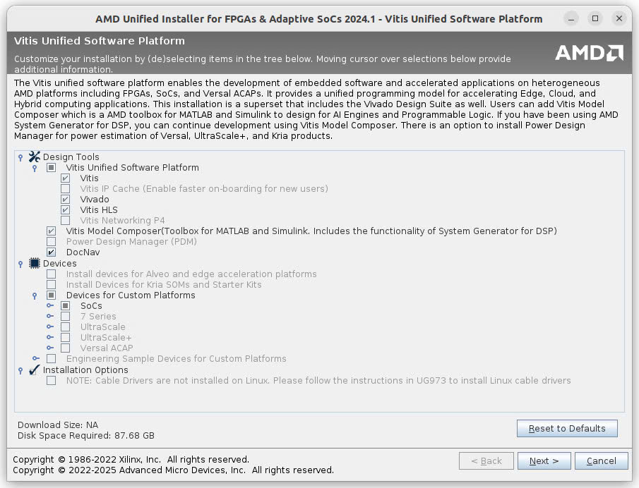

# HƯỚNG DẪN CÀI ĐẶT VIVADO & VITIS IDE CHO ZYNQ ULTRASCALE+ VÀ ZYNQ-7000

- Phiên bản: 2024.1
- Trước mỗi mục sẽ có cặp ngoặc vuông thể hiện thời gian ước tính cần thực hiện cho mỗi bước, nhằm giúp sắp xếp thời gian thực hiện cho hợp lý
- Tổng thời gian thực hiện ***nếu mạng nhanh, ổn định và máy tính không bị lỗi***: ~7h
- Tổng dung lượng cần trong quá trình cài: ~90GB
- Tổng dung lượng sau khi cài đặt hoàn tất: ~56GB
- Hướng dẫn dưới đây sử dụng Ubuntu 22.04. Các bản Linux khác và Windows thực hiện tương tự

## **0. [2h15p] Chuẩn bị**

- [15p] Tạo tài khoản AMD trên: https://www.amd.com/en
- [2h] (Không bắt buộc) Khuyến khích cài đặt hệ điều hành Ubuntu (chỉ nên cài các bản từ 18.04 đến 22.04, không dùng máy ảo): https://ubuntu.com/download/alternative-downloads

## **1. [2h] Download file cài từ Xilinx**

1. Download Web Installer (~300MB): https://www.xilinx.com/support/download/index.html/content/xilinx/en/downloadNav/vivado-design-tools/2024-1.html

2. Chạy file cài (**không dùng quyền sudo**, nếu dùng sudo như hình sẽ khiến ta phải cấu hình thủ công ở các bước sau này)

3. Đăng nhập và chọn như hình

4. Chọn như hình

5. Chọn như hình

6. Chọn như hình

7. Chọn "Next" và bắt đầu quá trình download file cài (~23GB), có thể tốn 2h tùy tốc độ mạng

## **2. [30p] Cài đặt từ file cài**

1. Chạy file cài đã tải về ở bước trước (**không dùng quyền sudo**, nếu dùng sudo như hình sẽ khiến ta phải cấu hình thủ công ở các bước sau này)

2. Chọn như hình

3. Chọn như hình

4. Chọn thư mục nơi sẽ cài đặt phần mềm và nhấn "Next"

5. Đợi quá trình cài đặt hoàn tất. **Lúc này sẽ hiện ra prompt thông báo** chạy script `installLibs.sh`, hãy làm theo prompt đó

## **3. [2h] Kiểm tra việc cài đặt Vivado & Vitis IDE thành công thực sự hay chưa**

1. Thực hiện mục `Source Files Setup` theo hướng dẫn để download file code mẫu: https://xilinx.github.io/xup_embedded_system_design_flow/index.html  
**CHÚ Ý: Không chọn board PYNQ-Z2 mà chọn board ZC702**

2. Thực hiện Lab1, chú ý chọn UART1 thay vì UART0 (không thực hiện phần `Test in Hardware`): https://xilinx.github.io/xup_embedded_system_design_flow/lab1.html

> **Việc cài Vivado & Vitis IDE được coi là thành công nếu hoàn thiện Lab1 mà không gặp lỗi.**